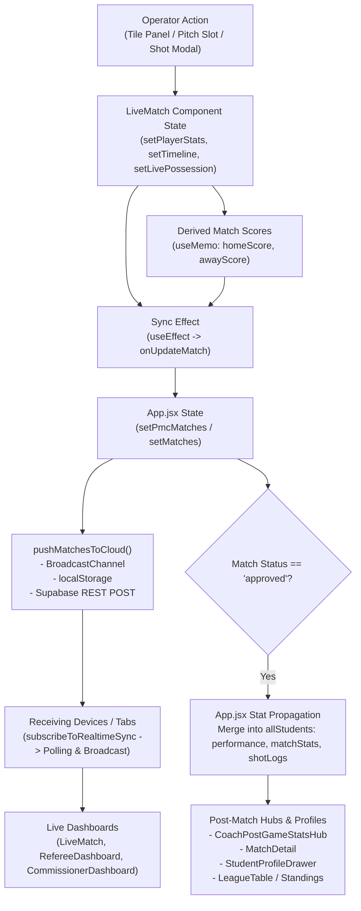

# Football Intelligence System: Troubleshooting & Developer Handoff Dossier

**Target Audience:** Software Engineer / AI Assistant (ChatGPT)  
**System Name:** FutureSPORT / EduVision Football Intelligence Platform  
**Repository Branch:** `testing`  
**Date:** September 2026  

---

## 1. Executive Summary & Tech Stack

This dossier details the architecture, data pipeline, and precise root causes for three critical issues reported on the match recording and analytics engine:
1. **Undoing a goal does not update the score.**
2. **Goalkeeper saves are missing from end-game stats.**
3. **All captured stats must propagate correctly to all required views.**

### Tech Stack Specifications
- **Frontend Framework:** React 19 (`react` 19.2.0, `react-dom` 19.2.0) with Vite 7.2 SPA architecture.
- **Styling:** Modular CSS variables and inline styles with dark/glassmorphic theme.
- **State Architecture:** React state (`useState`, `useRef`, `useMemo`, `useCallback`) with prop-drilling from top-level `App.jsx`.
- **Database & Sync:**
  - **Supabase Cloud (REST API):** Endpoint `${SUPABASE_URL}/rest/v1/pmc_matches_state`, persisting match state under record row `id = 'global_matches'`.
  - **Cross-Tab Synchronization:** HTML5 `BroadcastChannel('futuresport_demo_channel')` for zero-latency local synchronization.
  - **Local Persistence:** Browser `localStorage` fallback (`eduvision-pmc-matches-v8`, `eduvision-matches`).
  - **Polling Fallback:** `subscribeToRealtimeSync` polls Supabase every 1,200ms with JSON hash-based change detection.
- **Role of Gemini / AI:**  
  *Clarification:* Google Gemini is **not** an integrated runtime API inside the application client code (the platform operates deterministically on React + Supabase). Gemini is the AI model used within the Google DeepMind Antigravity engineering environment to inspect the codebase, perform static trace analysis, and generate this troubleshooting dossier.

---

## 2. End-to-End Data Flow: From Capture to Display



### Data Pipeline Stages
1. **Event Capture:**
   - Rapid stats (fouls, cards, corners, shots) are triggered via `TileDataCaptureControlPanel.jsx` (`onQuickLogEvent`) or clicking a player on the interactive pitch in `LiveMatch.jsx` (`handleQuickAction`).
   - Detailed shots open `LiveShotModal.jsx`, collecting $(x, y)$ goalmouth coordinates, shot technique (foot, header, penalty, free kick), outcome (`goal`, `saved`, `blocked`, `miss`), and assisting player.
2. **Local Component State Commit:**
   - In `LiveMatch.jsx`, `timeline` records the timestamped chronological event.
   - `playerStats` object stores individual player tallies keyed by player ID.
3. **Score Derivation:**
   - `homeScore` and `awayScore` are derived via `useMemo` by summing `playerStats[playerId].Goals` and opposing team `playerStats[playerId].ownGoals`.
4. **Parent Dispatch:**
   - A reactive `useEffect` watches `[playerStats, timeline, homeScore, awayScore, livePossession]` and fires `onUpdateMatch({...})`.
5. **Multi-Role Cloud Broadcast:**
   - `App.jsx:handleUpdateMatch` saves the updated match into state and triggers `pushMatchesToCloud()`.
   - `BroadcastChannel` instantly alerts other browser tabs on the same device.
   - Supabase REST API `pmc_matches_state` receives the full match array payload.
   - Remote devices poll every 1.2 seconds, calculate a hash via `computeMatchesHash()`, and re-render if updated.
6. **Post-Game Approval & Career Aggregation:**
   - When the match coordinator/referee marks the match `approved`, `App.jsx:955-1031` merges the match statistics into each player's permanent record (`allStudents.performance[year][matchday]`).
   - `CoachPostGameStatsHub.jsx` and `MatchDetail.jsx` render head-to-head matrix comparisons and squad box scores.

---

## 3. Root Cause Analysis & Likely Failure Points

### Issue 1: Undoing a Goal Does Not Update the Score

#### Root Cause 1: The "Ceiling Sync" Monotonic Latch Bug
- **Location:** `src/components/match/LiveMatch.jsx`, Lines 344–378.
- **Mechanism:**  
  `LiveMatch.jsx` contains a synchronization effect intended to merge incoming player stats from other connected data loggers:
  ```javascript
  // LiveMatch.jsx:360-367
  Object.keys(inc).forEach(k => {
      if (typeof inc[k] === 'number') {
          const maxVal = Math.max(cur[k] || 0, inc[k]);
          if (maxVal !== cur[k]) {
              mergedPlayer[k] = maxVal;
              updated = true;
          }
      }
  });
  ```
- **Why it breaks Undo:**  
  1. When a user clicks Undo, `handleUndoEvent` (lines 863–917) decrements `playerStats[pId].Goals` from $N$ to $N - 1$.
  2. Because `matchData` passed via props still retains the previous state with value $N$ until the parent cycle updates or if background polling fires, the sync effect executes `Math.max(cur[k], inc[k])` $\rightarrow$ `Math.max(N - 1, N) = N`!
  3. The stat is **immediately overwritten back to $N$**! A statistic can **never decrease**.
  4. Because `homeScore` and `awayScore` are derived directly from `playerStats[pId].Goals`:
     ```javascript
     // LiveMatch.jsx:524-528
     const homeScore = useMemo(() => {
         const goals = homePlayers.reduce((t, id) => t + (playerStats[id]?.Goals ?? 0), 0);
         const ownGoals = awayPlayers.reduce((t, id) => t + (playerStats[id]?.ownGoals ?? 0), 0);
         return goals + ownGoals;
     }, [homePlayers, awayPlayers, playerStats]);
     ```
     When `playerStats[pId].Goals` snaps back to $N$, the score re-evaluates to the un-decremented value.

#### Root Cause 2: Missing Reversion for Other Event Types in `handleUndoEvent`
- **Location:** `src/components/match/LiveMatch.jsx`, Lines 863–917.
- **Mechanism:**  
  `handleUndoEvent` only handles `goal`, `shotOnTarget`, `shotMissed`, `assist`, `yellowCard`, `redCard`, and `gkSave`.
  It **completely ignores**:
  - `foul`: `ps[playerId]['Fouls Committed']` is never decremented.
  - `corner`: `ps[playerId]['Corners Taken']` is never decremented.
  - `shotBlocked`: `ps[playerId]['Blocked Shots']` is never decremented.

---

### Issue 2: Goalkeeper Saves Missing from End-Game Stats

#### Root Cause 1: `handleSaveShot` Omits `ps[oppGkId].Saves`
- **Location:** `src/components/match/LiveMatch.jsx`, Lines 747–767.
- **Mechanism:**  
  When an operator logs a shot in `LiveShotModal` and selects the outcome `Saved`:
  ```javascript
  // LiveMatch.jsx:747-767
  } else if (result === 'saved') {
      s['Shots on Target'] += 1;
      s.Shots += 1;

      // Auto-attribute save to opposing team's Goalkeeper
      const oppPlayers = isHome ? awayPlayers : homePlayers;
      const oppGkId = oppPlayers.find(id => studentsById[id]?.position === 'Goalkeeper');
      if (oppGkId && studentsById[oppGkId]) {
          const oppGk = studentsById[oppGkId];
          if (!oppGk.saveLogs) oppGk.saveLogs = [];
          oppGk.saveLogs.push({ ... });
      }
  }
  ```
  Notice:
  1. It pushes a temporary object into `oppGk.saveLogs` (on the in-memory lookup reference `studentsById`), but **NEVER increments `ps[oppGkId].Saves` in `playerStats`**!
  2. It **never generates a `timeline` event** for the goalkeeper save (it only adds a `shotOnTarget` event for the shooter).

#### Root Cause 2: Dead Code in `handleQuickAction`
- **Location:** `src/components/match/LiveMatch.jsx`, Lines 584–664.
- **Mechanism:**  
  Line 584 defines:
  ```javascript
  const isShotAction = ['goal', 'shotOnTarget', 'shotMissed', 'shotBlocked', ...].includes(actionKey);
  ```
  When `actionKey === 'shotOnTarget'`, `isShotAction` is `true`, redirecting execution into `setShotModalData(...)`.  
  The `else` branch (lines 648–663), which had the logic:
  ```javascript
  ps[oppGkId].Saves = (ps[oppGkId].Saves || 0) + 1;
  ```
  is **unreachable dead code**.

#### Root Cause 3: Goalkeeper `saveLogs` Never Merged into Permanent Player Records
- **Location:** `src/App.jsx`, Lines 1000–1026.
- **Mechanism:**  
  When a match transitions to `'approved'`, `App.jsx` filters `updatedMatch.timeline` to build `playerShots` and appends them to `student.shotLogs`.  
  However, there is **no corresponding extraction for `saveLogs`**. Goalkeepers never receive save coordinates in `student.saveLogs`.

#### Root Cause 4: `CoachPostGameStatsHub.jsx` Displays 0
- **Location:** `src/components/coach/CoachPostGameStatsHub.jsx`, Lines 972–1004 & Lines 1107, 1194.
- **Mechanism:**  
  The post-game hub computes:
  ```javascript
  teamPlayerIds.forEach(id => {
      const ps = m.playerStats?.[id];
      if (ps) teamSaves += (ps.Saves || 0);
  });
  ```
  Because `ps[oppGkId].Saves` was never written during the match, `teamSaves` evaluates to 0, displaying 0 on the Head-to-Head Comparative Matrix and in the squad box score table.

---

### Issue 3: All Captured Stats Need to Appear Correctly Wherever Required

#### Complete Data Flow & Discrepancy Matrix
Below is the comprehensive audit of all stats captured in the system, how they are recorded, and where display discrepancies exist:

| Stat Name | Capture Trigger | Stored In `playerStats` | Stored In `timeline` | Persisted to Student Record (`App.jsx`) | Displayed in Live Match (`LiveMatch.jsx`) | Displayed in Post-Game (`CoachPostGameStatsHub.jsx`) | Displayed in Player Profile / Hub | Status / Bug Notes |
| :--- | :--- | :--- | :--- | :--- | :--- | :--- | :--- | :--- |
| **Goals** | Shot Modal / Quick Tile | `Goals`, `Shots on Target`, `Shots` | `type: 'goal'` | `perf.Goals`, `perf.Shots` | Yes (Score & Pitch Badge) | Yes (Score & Box Score) | Yes (Stats & Shot Map) | Undoing reverts due to `Math.max` ceiling sync. |
| **Own Goals** | Shot Modal / Quick Tile | `ownGoals` | `type: 'goal', goalType: 'own-goal'` | Attributed to match score | Yes (Score & Timeline) | Yes (Opponent Score) | — | Reversion blocked by `Math.max`. |
| **Assists** | Shot Modal / Quick Tile | `Assists` | `assistingPlayerId` | `perf.Assists` | Yes (Pitch Badge) | Yes (Box Score) | Yes (Profile Drawer) | Works, but undo assist sync can snap back. |
| **Shots on Target** | Shot Modal / Quick Tile | `Shots on Target`, `Shots` | `type: 'shotOnTarget'` | `perf['Shots on Target']` | Yes (Detail Drawer) | Yes (Matrix & Box Score) | Yes (Shot Map) | Auto-credited GK save missing. |
| **Shots Off-Target** | Shot Modal / Quick Tile | `Shots` | `type: 'shotMissed'` | `perf.Shots` | Yes (Detail Drawer) | Yes (Total Shots Matrix) | Yes (Shot Map) | Works. |
| **Blocked Shots** | Shot Modal / Quick Tile | `Blocked Shots`, `Shots` | `type: 'shotBlocked'` | `perf['Successful Blocks']` | Yes (Detail Drawer) | Aggregated into Shots | Yes (Profile Drawer) | **Missing from `handleUndoEvent`**. |
| **Goalkeeper Saves** | GK Save Modal / Shot Modal | `Saves` | `type: 'gkSave'` | `perf.Saves` | Yes (Detail Drawer) | Yes (Matrix & Box Score) | Yes (Save Map) | **Missing in `handleSaveShot`** & **Missing from `App.jsx` persistence**. |
| **Penalties Saved** | GK Save Modal | `Penalties Saved`, `Saves` | `type: 'gkSave', saveType: 'penalty'` | `perf['Penalties Saved']` | Yes (Detail Drawer) | Box Score | Yes (Profile Drawer) | Works when logged via modal. |
| **Free Kick Saves** | GK Save Modal | `Free Kick Saves`, `Saves` | `type: 'gkSave', saveType: 'freekick'` | `perf['Free Kick Saves']` | Yes (Detail Drawer) | Box Score | Yes (Profile Drawer) | Works when logged via modal. |
| **Yellow Cards** | Quick Tile / Pitch Click | `yellowCards` | `type: 'yellowCard'` | `matchStats.yellowCards` | Yes (Pitch Badge) | Yes (Matrix & Box Score) | Yes (Discipline Record) | Works. |
| **Red Cards** | Quick Tile / Pitch Click | `redCards` | `type: 'redCard'` | `matchStats.redCards` | Yes (Pitch Badge) | Yes (Matrix & Box Score) | Yes (Discipline Record) | Works. |
| **Fouls Committed** | Quick Tile | `Fouls Committed` | `type: 'foul'` | Not mapped in `perfStats` | Yes (Detail Drawer) | Yes (Matrix) | — | **Missing from `handleUndoEvent`** & omitted in `App.jsx:perfStats`. |
| **Corner Kicks** | Quick Tile | `Corners Taken` | `type: 'corner'` | `perf['Corners Taken']` | Yes (Detail Drawer) | Yes (Matrix) | Yes (Profile Drawer) | **Missing from `handleUndoEvent`**. |
| **Ball Possession** | Tile Panel Stopwatch | `liveState.possession` | `type: 'possession'` | Team match object | Yes (Top Banner Bar) | Yes (Matrix %) | Match Detail | Works. |
| **Passes Completed** | Manual Drawer Input | `Pass Completed` | — | `perf['Pass Completed']` | Yes (Detail Drawer) | Box Score (`passesCompleted`) | Yes (Profile Drawer) | Key naming inconsistency (`Pass Completed` vs `passesCompleted`). |
| **Tackles** | Manual Drawer Input | `Successful Tackles` | — | `perf['Successful Tackles']` | Yes (Detail Drawer) | Box Score (`tackles`) | Yes (Profile Drawer) | Key naming inconsistency (`Successful Tackles` vs `tackles`). |

---

## 4. Core Data Schemas

### Match Object Schema
```typescript
interface Match {
  id: string;                     // e.g. "pmc-fixture-1"
  round: string;                  // e.g. "Matchday 1 · PMC Group Stage"
  matchday: string;               // e.g. "Matchday 1"
  ageGroup: string;               // "PMC" or "Under-19"
  venue: string;                  // e.g. "Friendship, St. Michael"
  date: string;                   // ISO Date "YYYY-MM-DD"
  time: string;                   // "HH:mm"
  homeTeam: string;               // "PARADISE"
  awayTeam: string;               // "PRO SHOTTAS"
  homeTeamId: string;             // "pmc-club-14"
  awayTeamId: string;             // "pmc-club-16"
  status: 'upcoming' | 'live' | 'completed' | 'approved';
  homeScore: number | null;
  awayScore: number | null;
  possession?: {
    homePct: number;
    awayPct: number;
    homeSecs: number;
    awaySecs: number;
    activeSide: 'home' | 'away' | null;
  };
  homeSquadSelection?: {
    formation: string;           // "4-3-3"
    startingXI: string[];        // Array of 11 player IDs
    substitutes: string[];       // Array of 7 bench player IDs
  };
  awaySquadSelection?: {
    formation: string;           // "4-4-2"
    startingXI: string[];
    substitutes: string[];
  };
  liveState?: {
    period: '1H' | 'HT' | '2H' | 'FT';
    isRunning: boolean;
    startTime?: number;
    elapsedOffset: number;
    possession?: object;
    playerStats?: Record<string, PlayerStats>;
    timeline?: TimelineEvent[];
  };
  playerStats: Record<string, PlayerStats>;
  timeline: TimelineEvent[];
  referee?: string;
  commissioner?: string;
  operator?: string;
  teamSheetApproved?: boolean;
  teamSheetApprovedBy?: string;
}
```

### Timeline Event Schema
```typescript
interface TimelineEvent {
  id: string;                    // "event-1788814234567"
  elapsed: number;               // Seconds elapsed from kickoff
  minute: number;                // 1-indexed display minute (e.g. 23)
  period: '1H' | '2H' | 'ET1' | 'ET2';
  type: 'goal' | 'shotOnTarget' | 'shotBlocked' | 'shotMissed' | 'gkSave' | 'yellowCard' | 'redCard' | 'foul' | 'corner' | 'sub' | 'possession';
  result?: 'goal' | 'saved' | 'blocked' | 'miss';
  outcome?: string;              // "Goal", "Saved", "Blocked", "Off Target"
  playerId?: string;
  playerName?: string;
  team: 'home' | 'away';
  teamId: string;
  teamName: string;
  x?: number;                    // 0-100 goalmouth pitch coordinate
  y?: number;                    // 0-100 goalmouth pitch coordinate
  goalType?: 'foot' | 'header' | 'penalty' | 'freekick' | 'own-goal';
  shotType?: string;
  assistingPlayerId?: string | null;
  assistingPlayerName?: string | null;
  saveType?: 'normal' | 'penalty' | 'freekick';
  corner?: 'top-left' | 'top-right' | 'center' | 'bottom-left' | 'bottom-right';
}
```

### Player Stats Record Schema (`playerStats[playerId]`)
```typescript
interface PlayerStats {
  minutesPlayed?: number;
  Goals?: number;
  Assists?: number;
  Shots?: number;
  'Shots on Target'?: number;
  'Blocked Shots'?: number;
  ownGoals?: number;
  Saves?: number;
  'Penalties Saved'?: number;
  'Free Kick Saves'?: number;
  'Pass Completed'?: number;
  'Successful Dribbles'?: number;
  'Fouls Committed'?: number;
  'Corners Taken'?: number;
  'Successful Tackles'?: number;
  'Successful Clearances'?: number;
  'Successful Blocks'?: number;
  yellowCards?: number;
  redCards?: number;
}
```

---

## 5. Step-by-Step Fix Instructions for Developer / ChatGPT

To resolve the 3 issues without architectural regressions:

### Step 1: Fix the Ceiling Sync Latch in `LiveMatch.jsx`
Replace the unconditional `Math.max` merge in lines 345–378 with a state versioning or delta approach. Alternatively, if a local undo just occurred, prevent the ceiling latch from immediately re-applying stale parent numbers:
```javascript
// Add a local undo timestamp ref
const lastUndoTimeRef = useRef(0);

// In handleUndoEvent:
lastUndoTimeRef.current = Date.now();

// In incoming sync useEffect (lines 345-378):
// If an undo occurred within the last 3000ms, trust local playerStats over incomingStats
if (Date.now() - lastUndoTimeRef.current < 3000) {
    return;
}
```
*Even cleaner:* Sync the entire `playerStats` snapshot unconditionally from the master data logger using a revision sequence number (`version: prev.version + 1`) rather than `Math.max`.

### Step 2: Update `handleSaveShot` in `LiveMatch.jsx` to Credit Goalkeeper Saves
In `LiveMatch.jsx:747-767`, update the `saved` outcome to:
1. Increment `ps[oppGkId].Saves = (ps[oppGkId].Saves || 0) + 1`.
2. Push a companion `gkSave` event to `timeline` so both the shot and the save appear in chronological match events.

### Step 3: Add Missing Event Types to `handleUndoEvent` in `LiveMatch.jsx`
Add handlers for:
- `shotBlocked`: decrement `s['Blocked Shots']` and `s.Shots`.
- `foul`: decrement `s['Fouls Committed']`.
- `corner`: decrement `s['Corners Taken']`.
- `shotOnTarget` (when undone): decrement opposing goalkeeper's `ps[oppGkId].Saves`.

### Step 4: Persist Goalkeeper `saveLogs` in `App.jsx`
In `App.jsx:1000-1026`, extract goalkeeper saves from `updatedMatch.timeline` where `type === 'gkSave'` and append to `student.saveLogs`.

### Step 5: Normalize Key Naming for Box Score Table in `CoachPostGameStatsHub.jsx`
Ensure lines 1192–1193 fall back gracefully:
- Passes: `ps.passesCompleted ?? ps['Pass Completed'] ?? 0`
- Tackles: `ps.tackles ?? ps['Successful Tackles'] ?? ps['Tackles Per Game'] ?? 0`

---

## 6. Packaged Files Available in This Directory
1. `troubleshooting/SYSTEM_OVERVIEW_AND_TROUBLESHOOTING.md` (This document)
2. `troubleshooting/CODE_EXTRACTS_REFERENCE.md` (Complete sanitized code extracts)
3. `troubleshooting/sample_match_payload.json` (Valid JSON sample match for unit testing)
